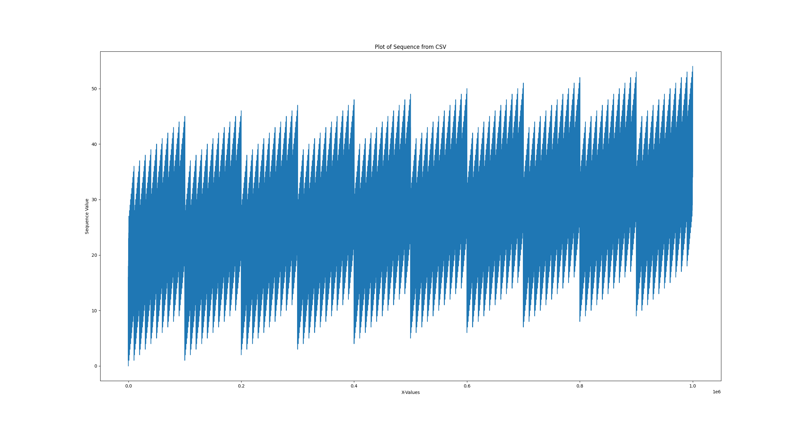

## Digit Sums

The digit sum of a number is the sum of all of its digits.

Example 1:
For the number 1234, the digit sum is:
```
1+2+3+4=10
```
Example 2:
For the number 987, the digit sum is:
```
9+8+7=24
```

## Generate some digit sums

```bash
cd 00-digit-sums
python sum.py -r 1000 -o sums/1000.csv
python sum.py -r 10000 -o sums/10000.csv
```

## Plot the digit sum sequence

```bash
python splot.py sums/100.csv 
```

Sequence plot of the first million digit sums

